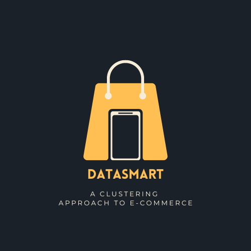

# Insiders Program

  

## Overview
This is a clustering project with the goal of creating a loyalty program for an e-commerce business.

The company DataSMart, as well as the Insiders program, are fictitious and serve only to give us a business context for our problem. The data was acquired from the [Ecommerce-Data](https://www.kaggle.com/datasets/carrie1/ecommerce-data) from Kaggle. For this project, we conducted an exploratory analysis, trained different unsupervised machine learning models, applied spatial reduction methods, and automated new processes for forming customer clusters.

From a business perspective, this was a very challenging project and we assumed characteristics based on a model study that took into account a customer segmentation model based on Recency, Frequency, and Monetary. In general, Recency can be considered as "How recently a customer has made a purchase", Frequency as "How often a customer makes a purchase", and Monetary value as "How much money a customer spends on purchases". Additionally, in an [RFM model](https://www.annexcloud.com/blog/revolutionising-segmentation-individualisation-using-rfm-to-step-further/), Recency can be considered as the time since the last purchase and the responsibility of our customers, Frequency as the time between transactions and their engagement on the platform, and Monetary as the total revenue and which high-value purchases were made. 

This RFM model is only possible if the company has a minimum customer relation management policy. An initial customer segmentation is also an activity that could be done in advance of any Machine Learning process for a company, and we can think about our case according to the graph below:

  

Some of the categories in the graph are self-explanatory, and our interest is immediately in the categories:

**Champions**: these are customers with recent purchases, but they already make them frequently, spending a high value. We should offer some kind of reward for these customers.

**Loyal Customers**: these customers have made recent purchases or make them frequently while spending a good amount of money on them. We can think of a loyalty program (like Insiders) and take upsell actions.

**In Need of Attention**: customers that could be lost if they are not engaged.

**New Customers**: here are customers who have made recent purchases but only do so with low frequency. We need to work on building relationships and offer a catalog of special offers.

**At Risk**: customers who have not made recent purchases. They should be targeted with reactivation campaigns, offers, and products.

We want to know exactly who our Champions are, which we will call Insiders.

# 1. Business Problem

## 1.1. Business Context
The company DataSMart is a "Multi Brand Outlet" that sells second-line products from various brands at a lower price through an e-commerce platform. In just over a year of operation, the marketing team noticed that some customers in their base buy higher-priced products with high frequency, contributing a significant portion of the company's revenue.

Based on this insight, the marketing team is launching a loyalty program for the best customers in their base, called "Insiders". However, the team does not have advanced knowledge in data analysis to select program participants. For this reason, the marketing team requested the data team to provide a selection of eligible customers for the program using advanced data manipulation techniques.

## 1.2. Objectives
We need to determine who the eligible customers are to participate in the Insiders program. With this list, the marketing team will carry out a series of personalized and exclusive actions for this group to increase revenue and purchase frequency. As a result of this project, we expect you to deliver a list of eligible people to participate in the Insiders program, along with a report answering the following questions:

1. Who are the eligible people to participate in the Insiders program?
2. How many customers will be part of the group?
3. What are the main characteristics of these customers?
4. What percentage of revenue contribution comes from Insiders?
5. What is the revenue expectation for this group in the next few months?
6. What are the conditions for a person to be eligible for Insiders?
7. What guarantee is there that the Insiders program is better than the rest of the base?
8. What actions can the marketing team take to increase revenue?

# 2. Business Assumptions

## 2.1. General 
We assume that the marketing team will require constant updates of these customer clusters in order to promote purchases at the DataSMart. To achieve this, a simple automation was devised using different Python libraries to automate this process on the local network as well as in the cloud, with data projection for presentation with Metadata.

## 2.2. Variables
| Feature                  | Description                                                  |
| -----------------------| ------------------------------------------------------------ |
| Invoice Number          | Unique identifier for each transaction                       |
| Stock Code Product      | Item code                                                     |
| Description Product     | Item name                                                     |
| Quantity                | The quantity of each item purchased per transaction           |
| Invoice Date            | The date on which the transaction occurred                    |
| Unit Price              | Product price per unit                                        |
| Customer ID             | Unique identifier for the customer                            |
| Country                 | The name of the country where the customer resides            |

For the description of these variables, we consulted the link below:
https://www.kaggle.com/datasets/carrie1/ecommerce-data

# 3. Solution Planning

## 3.1. Final Product
A database containing customers separated into their clusters. This database has been hosted on AWS and can be updated daily and made available to the company. It is also possible to query it for visualization in a tool (we use Metadata).

## 3.2. Tools Used
> Python 3.10.10;
>
>VS Code;
>
>Jupyter Notebook;
>
>YData-Profiling;
>
>Metadata;
>
>SQL:
>> SQLite and PostgreSQL;
>
>Git and Github;
>
>Amazon Web Services: 
>>S3, RDS and EC2.

# 4. Solution Strategy

My strategy to solve this challenge was:

**Step 01. Data Description:** we renamed the columns, checked the dimensions and data types of the DataFrame, adjusted parts of the missing data by creating new IDs for customers. The missing data that remained in the dataset were from the `description` column and we assumed that they were some type of returns. Finally, we performed a descriptive statistical analysis.

**Step 02. Data Filtering:** we performed filtering on numerical and categorical attributes, removed specific rows from the `country` column, dropped the `description` column, the user with `customer_id` 16446, and separated the DataFrame into two DataFrames to understand how many products were being purchased and how many were being returned. The removal of rows from the `country` column was done with the purpose of studying customer behavior by country in the future. The reason why we removed user 16446 was due to the purchase of 80995 items and the return of the same items, which led us to believe that it was some sort of mistake.

**Step 03. Feature Engineering:** we created a set of features that we thought could help us segment our customers into clusters according to the RFM segmentation model we discussed earlier:
- `gross_revenue`
- `recency_days`
- `qty_invoices`
- `qty_items`
- `qty_products`
- `avg_ticket`
- `avg_recency_days`
- `frequency`
- `qty_returns`

**Step 04. Exploratory Data Analysis:** we used YData-Profiling to obtain a report with univariate, bivariate, and multivariate analyses of our features and manually selected some rows that could contain outliers pointed out by the tool. The latest version of this report is the file `output_v2.html` which is in the reports folder. Then we conducted a study on the spatial distribution of our data, the idea here was to find the best way to avoid high dimensionality. The methods used for this study were: 
- Principal Component Analysis, 
- Uniform Manifold Approximation and Projection, 
- t-Distributed Stochastic Neighbor Embedding, and 
- Tree-Based Embedding using a `RandomForestRegressor()` model. 

Finally, we applied `MinMaxScaler` to our features and chose a combination of Uniform Manifold Approximation and Projection with Tree-Based Embedding.

**Step 05 & 06. Data Preparation and Feature Selection:** it was not necessary to apply any further data preparation because the embedding spaces were organized by our tree based model algorithm and reduced with Umap. There was also no need to perform any feature selection.

**Step 07. Hyperparameter Fine Tunning:** we trained four unsupervised models for the clustering task: K-Means, Gaussian Mixture Model, Hierarchical Clustering, and Density-Based Spatial Clustering of Applications with Noise. We evaluated the models based on their Within-Cluster Sum of Squares and Silhouette Score, which are:
- `WCSS`, or Within-Cluster Sum of Squares, is the sum of the squared distances between each point and the centroid of the cluster it belongs to. The goal is to minimize the variation within each cluster.
- `SS`, or Silhouette Score, measures the quality of a cluster by evaluating how well each point fits in its cluster and how different it is from other clusters. The Silhouette Score ranges from -1 to 1, with values close to 1 indicating that the point is well-fitted to its cluster and far from other clusters, while values close to -1 indicate that the point may have been assigned to the wrong cluster.

**Step 08. Model Training:** given our metrics, we decided on the GMM, Gaussian Mixture Model. This model assumes that the data points are generated from a mixture of several Gaussian distributions, and it estimates the parameters of each distribution to assign each data point to the most likely cluster. We plotted a graph to obtain the best Silhouette Score between 2 and 25 clusters and ended up choosing a model with 8 clusters, which, although not obtaining the best Silhouette Score, provides a number of clusters that the marketing team can comfortably consider which actions will be taken on these customers.

**Step 09. Cluster Analysis:** the resulting clusters were grouped according to features that can offer direct insights into their characteristics, so that each cluster should inform us how many customers are in it, its percentage relative to the total number of customers, and the averages of gross revenue, recency in days, how many products they purchased, quantity of products, purchase frequency, and the quantity of returned products.

**Step 10. Deploy Model to Production:** we created a SQLite database locally to explore the possibility of automating the creation of clusters whenever the marketing team requested it. The idea was to ingest data from new and old customers, redo the clusters, and show the results. We used the papermill library to manage this automation with the python-crontab library if regular evaluation was requested within a time period. We used AWS services to make this solution work on the cloud: we created an S3 bucket to store the pkl files and the final model, an RDS PostgreSQL database to allow us to ingest and add new data, and an EC2 instance to run the solution remotely and provide a new notebook with the date and time of this task.

# 6. Machine Learning Model Applied

We applied the Gaussian Mixture Model, `GaussianMixture`, which is a probabilistic model based on the assumption that data is generated from normal (i.e. Gaussian) distributions, where each distribution represents a cluster of data. The algorithm randomly initializes the parameters of the distributions and then iteratively updates these parameters until convergence. During each iteration, the algorithm performs the **E-step**, where it calculates the probability of each data point belonging to each distribution, and the **M-step**, where it updates the parameters of the distributions based on the calculated probabilities. 

After estimating the parameters of the distributions, the algorithm can be used for clustering and density estimation. For the purposes of this project, which is a clustering problem, the algorithm assigns each data point to the distribution with the highest probability and considers all points assigned to the same distribution as belonging to the same cluster.

# 7. Machine Learning Model Performance

Our final model has a Silhouette Score of **0.38966619968414307** for 8 clusters, which, as previously mentioned, was a number we found reasonable to present to the marketing team. Below we present the final list of our clusters ranked by the average of their `gross_revenue`:

| cluster | customer_id | perc_customer | gross_revenue | recency_days | qty_products | frequency | qty_returns |
| :-----: | :---------: | :-----------: | :-----------: | :----------: | :----------: | :-------: | :---------: |
|    2    |     86      |    1.510097   | 4179.930465  |  182.767442  |  485.627907  |  1.000000 |   0.000000  |
|    5    |    1103     |   19.367867   | 2319.363409  |  89.511333   |  116.353581  |  0.364091 |  22.395286  |
|    3    |    1675     |   29.411765   | 1983.856125  |  91.970746   |  84.160597   |  0.419957 |  77.180299  |
|    1    |    819      |   14.381036   | 1952.084786  |  90.787546   |  79.439560   |  0.396535 |  18.326007  |
|    0    |    732      |   12.853380   | 1524.104563  |  98.396175   |  84.438525   |  0.438622 |  12.411202  |
|    4    |    537      |   9.429324    | 1164.943389  |  92.491620   |  82.674115   |  1.000000 |   0.000000  |
|    6    |    550      |   9.657594    | 706.504909   |  297.225455  |  56.094545   |  1.000000 |   0.000000  |
|    7    |    193      |   3.388938    | 701.622798   |  196.269430  |  73.689119   |  1.000000 |   0.000000  |

# 8. Business Results
>## Insiders:
> Number of Customers: 86 (1.51% of the customers)
>
> Gross Revenue: US$ 4179.93
>
> Average Recency: 183 days
>
> Average number of products purchased : 486 produtos
>
> Frequency of products purchased: 100%

### 1. Who are the eligible people to participate in the Insiders program?
### 2. How many customers will be part of the group?
### 3. What are the main characteristics of these customers?
### 4. What percentage of revenue contribution comes from Insiders?
### 5. What is the revenue expectation for this group in the next few months?
### 6. What are the conditions for a person to be eligible for Insiders?
### 7. What guarantee is there that the Insiders program is better than the rest of the base?
### 8. What actions can the marketing team take to increase revenue?

# 9. Conclusions
-

# 10. Lessons Learned
This was not only the first Clustering project we carried out, but also the first one with a solution involving unsupervised machine learning models. Additionally, we conducted research around dimensionality reduction algorithms, as well as the business model incorporated in this challenge. It was also the first time we had the opportunity to think of a solution using AWS.

# 11. Next Steps to Improve
It is possible to devise a better solution for report automation using AWS, since the platform offers solutions for this type of task. If we acquire new data, we can retrain our models and decide whether the number of clusters is appropriate for our customer catalog.